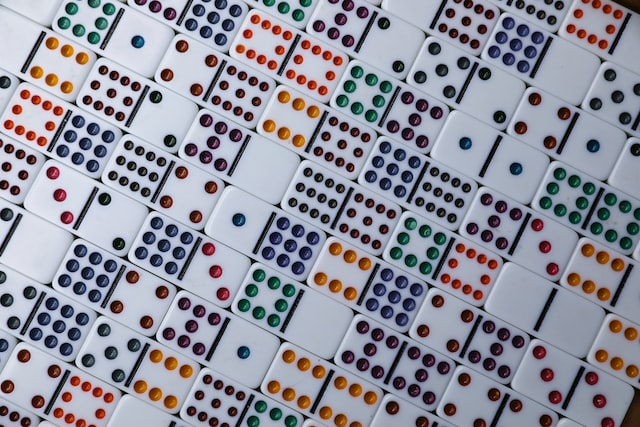
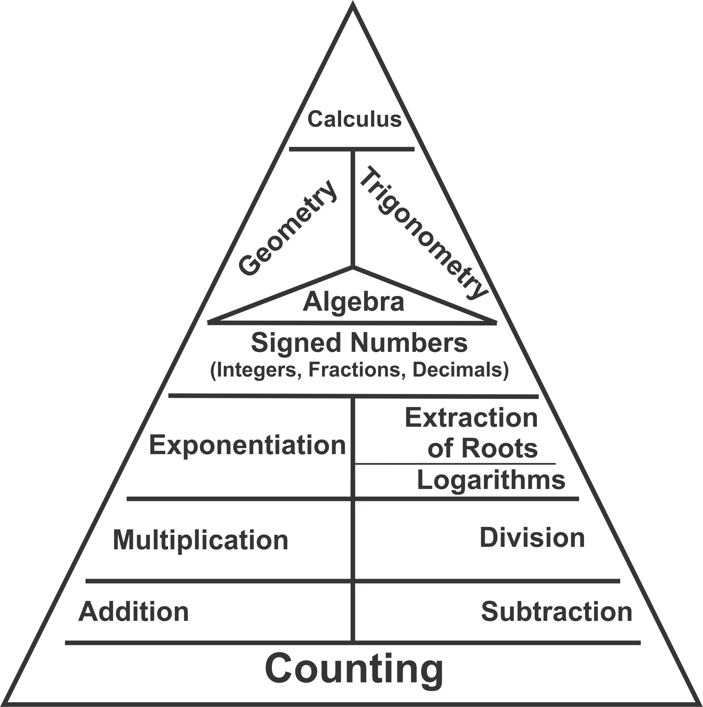

# How do numbers work?

## Learning Goals

* Symbols, Number Line, Comparing Integers (<, >, and =), Expanded Notation
* Like and Unlike Terms 
* Scientific Notation 

## Why This Matters

**Number.** It's the idea of how much, how many, how big. It's the concept of both quantity and space. It's the way we observe and measure the patterns in the world.

> ***The unity and inner consistency of the world derives from the oneness of God.***
>
> JOHN BYL From pg, 262 of The Divine Challenge on Matter, Mind, Math, and Mearning 

**Mathematics** is the study of these patterns, and thus is the study of number. Often in the United States *mathematics* is shortened to the singular word *math*. But this is not quite correct: because there is more than one method of observing and talking about number in the world around. 

Look at the diagram below. It shows a pyramid with **counting** at the very base or foundation and building up to **calculus**, the highest branch of mathematics that humans have ever used. But did you know that before Newton and Leibniz began developing the practice of calculus, nearly everyone used **algebra** to solve the same difficult engineering problems?

Similarly, **arithmetic** (where we use addition, subtraction, multiplication, and division) worked just fine for most things; but **algebra** became a faster and more efficient way to look at numbers. Arithmetic. Algebra. Geometry (the visual edition of algebra) and Calculus. These are all different lenses through which we can view the world of number.

*Pyramid of Math Concepts***Source:** James Nickel, Dance of Number.

But the foundation of all these mathematical concepts -- from adding to graphing to derivatives and limits -- is **counting**. In Step 1 of Math Masters, we will be introducing...

- **Integers**, or counting numbers
- The **number line**, a way to visual numbers above and below 0
- **Notation**, how we write numbers
- and **Numeration**, how we read numbers

This may sound elementary, but at the high school and college level, there is a lot more to numbers than you learned in fourth grade!

------

The HiSet high school equivalency exam (developed by ETS) dedicates 19% of the test content to "Numbers and Operations on Numbers."

In this step, you will learn things like scientific notation, like and unlike terms, negative and positive numbers, and the difference between rational, irrational, and natural numbers. Most importantly, you will prepare the way for excelling at higher maths like algebra and better understand God's creation.

## Go to:

* [Review 1](#01-review1)
* [Review 2](#01-review2)
* [Review 3](#01-review3)
* [Review 4](#01-review4)

------

## Spaced Reviews

### THURSDAY: Meet the Integer {#01-review1}

> As you watch these videos, **have pen and paper with you** so that you can take copy the examples given. Be sure to take notes on the following math terms:
>
> - **integers**
> - **positive integers**
> - **negative integers**
> - **natural numbers**
> - **counting numbers**
> - **infinity**
> - **zero**
> - **context**

<iframe width="560" height="315" src="https://www.youtube-nocookie.com/embed/idTtdWVmFAQ" title="YouTube video player" frameborder="0" allow="accelerometer; autoplay; clipboard-write; encrypted-media; gyroscope; picture-in-picture" allowfullscreen></iframe>

<iframe width="560" height="315" src="https://www.youtube-nocookie.com/embed/nFf2vkSaE9o" title="YouTube video player" frameborder="0" allow="accelerometer; autoplay; clipboard-write; encrypted-media; gyroscope; picture-in-picture" allowfullscreen></iframe>

<iframe width="560" height="315" src="https://www.youtube-nocookie.com/embed/eVShvGSGANM" title="YouTube video player" frameborder="0" allow="accelerometer; autoplay; clipboard-write; encrypted-media; gyroscope; picture-in-picture" allowfullscreen></iframe>

### FRIDAY: Numbers are Directional {#01-review2}

> *He is eternal and infinite, omnipotent and omniscient; that is, his duration reaches from eternity to eternity; his presence from infinity to infinity; he governs all things and knows all things…He is not eternity or infinity, but eternal and infinite.*
>
> SIR ISAAC NEWTON, Principia

<iframe width="560" height="315" src="https://www.youtube-nocookie.com/embed/Anob0AXpVbA" title="YouTube video player" frameborder="0" allow="accelerometer; autoplay; clipboard-write; encrypted-media; gyroscope; picture-in-picture" allowfullscreen></iframe>

##### Take some time to explore the number line. 

- What mathematical expressions can you represent on a number line?
- Are negative numbers greater than or less than 0? Is -20 less than +15?
- How do you think addition and subtraction could be shown on a number line? What about multiplication and division? Could you show exponents on a number line?
- Where on the number line would you plot the value \( 5\frac{1}{2} \)? What is it greater than? What is it less than? 
- What about the value \( \pi = 3.14 \)? What is it greater than? What is it less than? 

<iframe src="https://www.didax.com/apps/number-line/" width="540" height="360"></iframe>

### SUNDAY: Math Language and Symbols {#01-review3}

[slides]

#### Complete the following exercises:

Read the sentence.

​	**1.**   **My score on the spelling test was 83**. 

Now finish the math sentence.

​	**If the spelling test score is represented by \*a, then 	a = 83.\***

Practice with the following sentences:

​	**2.**  My father’s annual income is $60,000. If the income is 	represented by ***i\****,* then ***i\* = ___.**

​	**3.**   John ran the race in 50 seconds. If the running time is 	represented by ***t\*** , then ***t = ___.\***

​	**4.**  Mrs. Smith said, “We’ve had 300 customers visit our store today.” If the customers are represented by ***c\*** , then 	***c = ___.\***

​	**5.**  The average day’s wage in New Testament times was 	one denarius. If ***w\*** represents a day’s wage, then ***w = 	___.\***

​	**6.**  Write this number in expanded form: **48**        

​	*Answer: 40 + 8*

​	**7.**   Write this number in expanded form: **11**

​	**8.**  Write this number in expanded form: **23**

​	**9.**  Write this number in expanded form: **418**

​	**10.** Write this number in expanded form: **8718**

​	**11.**  Which statement is true?

​		a.   11 > 3        OR    3 > 11

​		b.   4 > 9         OR    9 > 4

​		c.   23 > 27       OR    27 > 23

​		d.   423 > 418     OR    418 > 423

​		e.   8718 > 8720   OR    8720 > 8718

### MONDAY: Like Terms and Unlike Terms {#01-review4}

<iframe width="560" height="315" src="https://www.youtube-nocookie.com/embed/WUwBR1Zkfzg" title="YouTube video player" frameborder="0" allow="accelerometer; autoplay; clipboard-write; encrypted-media; gyroscope; picture-in-picture" allowfullscreen></iframe>

Collect the like expressions, then write the final answer.

1. 4 apples plus 6 apples plus 9 pears

2. 10 oranges plus 2 mangoes plus 2 oranges

3. 3 SUVs plus 7 dirt bikes plus 5 SUVs
   $$
   3+7x+5
   $$

   $$
   4x+13+10x
   $$

   $$
   4a^2+13a+10a^2
   $$

   $$
   	{3b}^2+2b^2+4b
   $$

   
